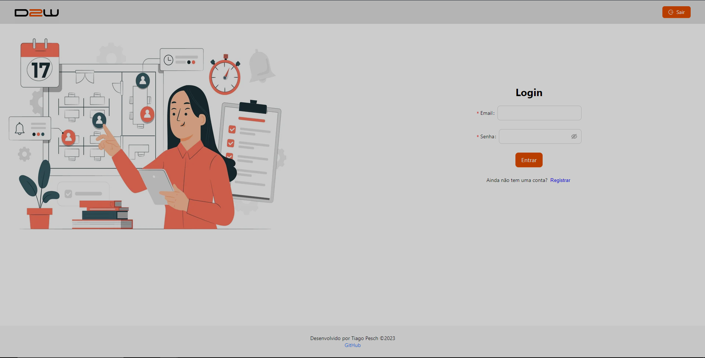
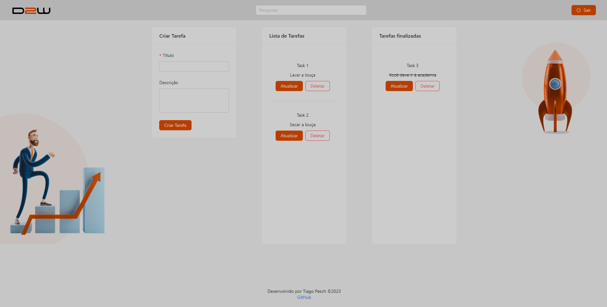

Desafio Todo-List D2W
## Data2Win
Desafio técnico para a vaga de desenvolvedor Full-Stack.


## Tecnologias

# Tecnologias usadas no frontend.

* React 18.2.0
* react-router-dom ^6.16.0
* React-icons 4.7.1
* React-toastify 9.1.3
* antd 5.9.4
* Redux 8.1.3
* Reduxjs/toolkit 1.9.7

# Tecnologias usadas no backend.
* Flask==3.0.0
* flask-jwt-extended==4.5.3
* Flask-SQLAlchemy==3.1.1
* SQLAlchemy==2.0.21
* mysqlclient==2.2.0

## Serviços usados

* Github

## Requisitos
- Docker
- Docker Compose

## Como Rodar o Projeto

### Passo 1: Clonar o Repositório

Para clonar o repositório, execute o seguinte comando no terminal:

```
bash git clone <https://github.com/tiagokp97/desafio_tecnico_d2w.git>
```

### Passo 2: Acessar a Pasta do Projeto

Após clonar o repositório, navegue até a pasta desafio_tecnico_d2w:

```
cd desafio_tecnico_d2w
```

### Passo 3: Executar o Docker Compose

Agora, para subir todos os serviços da aplicação, execute o seguinte comando:

```
docker-compose up
```

Isso irá iniciar todos os containers e serviços necessários para o funcionamento da aplicação.

Parabéns, agora a aplicação deve estar rodando na sua máquina local! Acesse via navegador ou utilize a API conforme documentação.


###  Principais Funcionalidades da Aplicação
🔐 Criação e Login de Usuários com JWT
Utilizamos JSON Web Tokens (JWT) para autenticar usuários. Isso permite um fluxo de login seguro e eficaz, com a geração de tokens para sessões autenticadas.

📝 Gerenciamento de Tarefas
A aplicação permite que os usuários criem, visualizem, atualizem e excluam tarefas. Isso abrange todas as operações CRUD, tornando o gerenciamento de tarefas simples e direto.

🔄 Atualização de Status via Arraste e Solte
Implementamos uma funcionalidade de arrastar e soltar que permite aos usuários mudar o status de uma tarefa de "Em Andamento" para "Finalizada", arrastando-a para a coluna correspondente.

📅 Registro de Datas
Cada tarefa possui informações sobre a data de criação, a última atualização e a data de deleção. Isso ajuda a manter um histórico de todas as atividades relacionadas à tarefa.

🗑️ Soft Delete
A aplicação emprega o conceito de "Soft Delete", permitindo que os itens excluídos sejam recuperados posteriormente. Isso é útil para manter logs precisos e oferece a possibilidade de reaver tarefas que foram excluídas.

🔍 Filtros de Tarefa
A aplicação oferece um filtro eficaz para tarefas com base no seu título, permitindo que os usuários localizem tarefas "Concluídas" ou "Em Andamento" de forma rápida e eficiente.

### Documentação

A documentação completa da aplicação, com todos os tipos de retorno de cada rota, podem ser encontrados neste link:
```
https://winter-escape-115766.postman.co/workspace/New-Team-Workspace~31b370ef-fa4f-4838-82c7-aa810ce0fa4f/collection/30367643-8317b44e-f8b9-415a-be3b-95cc0a5d94c4?action=share&creator=30367643
```
E também pode ser importado no seu próprio postman, utilizando o arquivo collection "Documentação da API - Projeto D2W- Todo List.postman_collection.json" disposto na pasta "documentation" na raiz do projeto

É importante lembrar, que para testar as rotas e seus possíveis retornos, é necessário manter a aplicação rodando conforme disposto no início do texto.

### Visualização da tela inicial


### Visualização da tela de criação de tarefas



